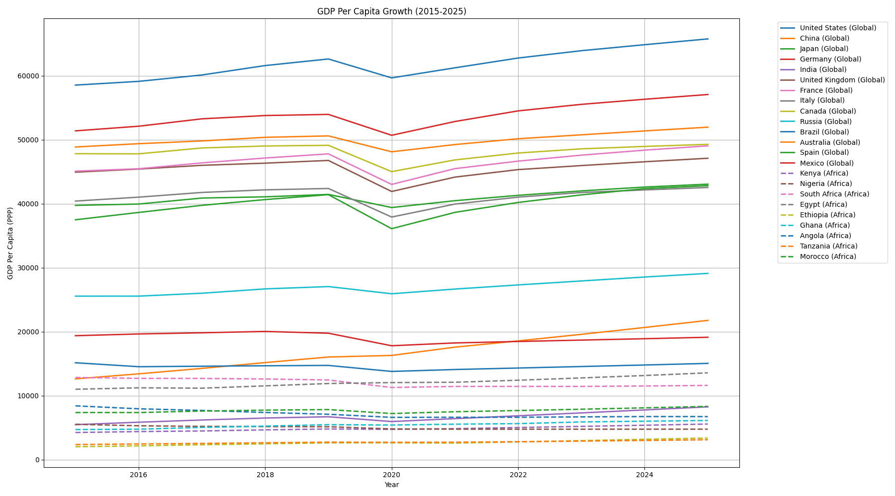
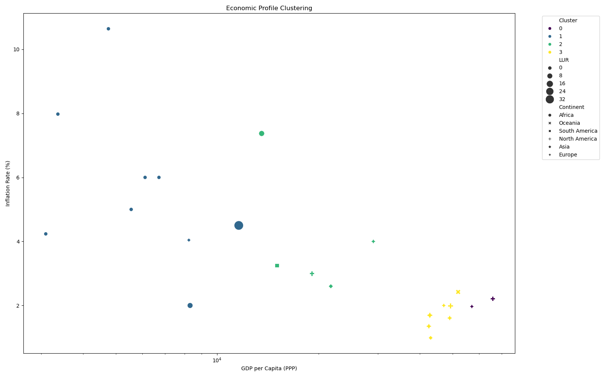
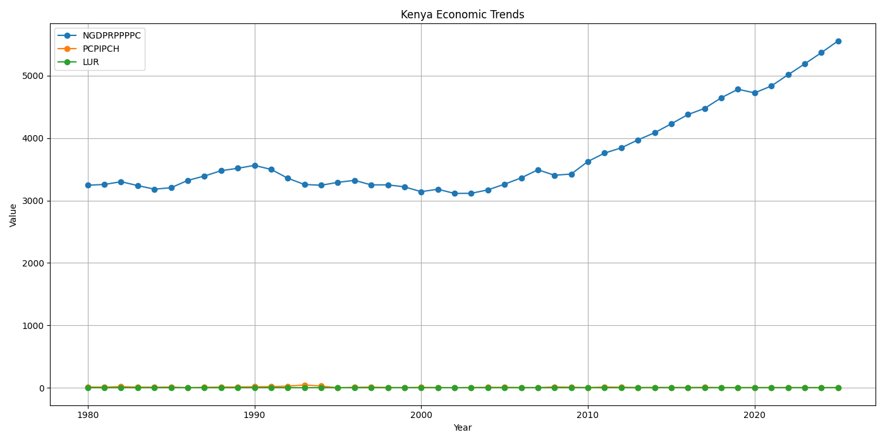

# World Economic Outlook Analysis (WEOCT2020IMF)

## 📌 Project Overview
A comprehensive analysis of the IMF's World Economic Outlook dataset, combining data exploration, machine learning modeling, and API deployment. This project provides:
- **Economic Trend Visualization**: Compare GDP growth across African and global economies
- **Predictive Analytics**: Forecast GDP per capita using key economic indicators
- **Automated Reporting**: Generate country-specific economic profiles
- **REST API**: Deployable endpoint for real-time GDP predictions

Built with Python, Flask, and Scikit-learn. [Explore the code on GitHub](https://github.com/danielmuthama23/WOEOCT2020IMF).

---

## 🚀 Key Features

### 1. GDP Trend Analysis
- Compare GDP per capita (PPP) growth trajectories (2010-2020)
- **15 Global Economies**: USA, China, Germany, Japan, etc.
- **10 African Nations**: Kenya, Nigeria, South Africa, Egypt, etc.

### 2. Economic Clustering
- K-means clustering (n=4) based on:
  - GDP per capita 
  - Inflation rate 
  - Unemployment rate
- Interactive visualizations of country groupings

### 3. Predictive API
- Flask endpoint for GDP forecasts
- Input: Continent, population, and 5 key economic indicators
- Output: Predicted GDP per capita with feature importance

### 4. Automated Reporting
- Generate PNG reports for any country showing:
  - GDP trends
  - Inflation patterns
  - Unemployment rates
  - Cluster associations

---

## 📊 Visual Comparisons

### Kenya vs Global Economies
  
*Kenya's steady growth compared to volatile trends in larger economies*

### African Economic Clusters
  
*4 distinct economic profiles identified through ML clustering*

### Country Economic Profile
  
*Automated report showing Kenya's key indicators over time*

---

## 🔧 API Documentation

### Endpoint
  `POST /` - Predict GDP per capita

**Request Body**:
  {
    "continent": "Africa",
    "population": 50000000,
    "Implied PPP conversion rate": 150.2,
    "Current account balance": -3.1,
    "Volume of exports of goods": 4.8,
    "Gross national savings": 12.5,
    "Inflation rate": 6.2
  }

### Response Example

**Successful Prediction**:

  {
    "prediction": 1523.45,
    "feature_importance": [
      {"feature": "Implied PPP conversion rate", "weight": 0.32},
      {"feature": "Volume of exports of goods", "weight": 0.28}
    ],
    "cluster": "Emerging Growth"
  }