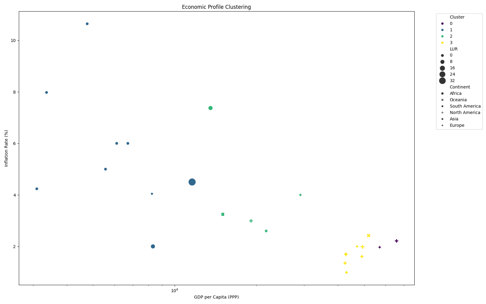

# World Economic Outlook Analysis


## Project Overview
Analysis of IMF World Economic Outlook data with machine learning predictions and API integration.

## Key Features
- GDP trend comparison between African and global economies
- Economic clustering visualization
- GDP per capita prediction API
- Automated country report generation

## Visual Comparisons

### Kenya vs Global Economies

*Kenya's GDP growth trajectory compared to major global economies*

### African Economic Clusters

*Clustering of African nations based on economic indicators*

### Kenya Economic Report

*Detailed economic indicators for Kenya (2010-2020)*

## API Documentation

**Endpoint:** `POST /`
```json
{
  "continent": "Africa",
  "population": 50000000,
  "feature_1": 1.5,
  "feature_2": 3.2,
  ...
}